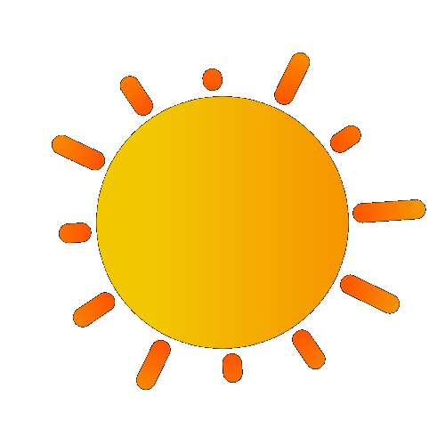
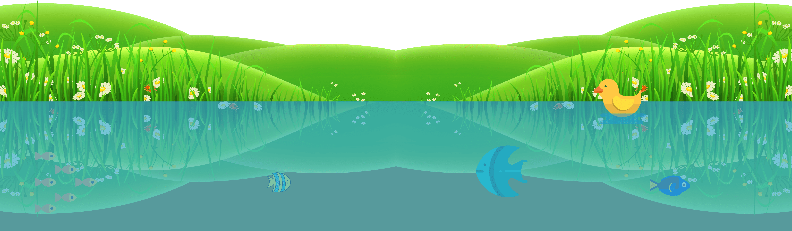
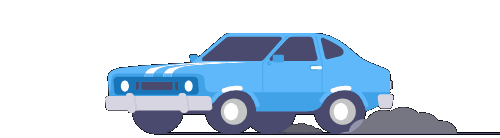
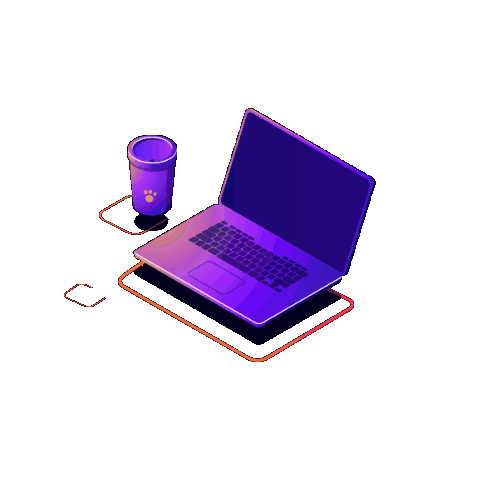
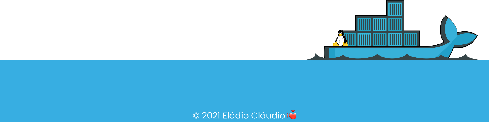

<section>

 
 
 
 

 

Technology lover from an early age
 
I am a dreamy young Angolan 🇦🇴.
 
I love to learn new things.
 
I really enjoy learning new things 
 
and making new friends.
 
Feel free to get in touch with me.
 
 

 
 
 

Focused on building a successful career, I have been looking for experience through open-source projects...
 
I work on freelance projects and have gained some experience in them, I'm also part of some communities, and these communities have contributed a lot not only to mine, but also to the careers of many software developers like me...

</section>

 
 
 
 

<section>

 
Running in pursuit of my goals

</section>

 
 
 
 
 
 

<section>

Below you can see some statistics, which bring you the time 
 
I spend writing code, this relative to the last 7 days...These statistics bring you not only
 
the time I spend writing code, but also the language. 
 
All in real time.

 
 

</section>

 
 
 
 
 
 
 
 
 

<section>

At the moment I'm not only studying, but I've also been working with different technologies.
  
I have worked 90% of the time as a frontend developer. Specifically working with Angular 2 and Reactjs...
 
I like to think outside the box, for this reason I am always open to new opportunities, 
 
even if they involve learning a new technology.

</section>

 
 
 
 
 
 
 

<section>

 
 
 

Fortunately or unfortunately, 
 
I haven't attended any university so far. 
 
A long time ago I finished high school in
 
the Industrial Electronics and Automation course, 
 
where I already saw some programming 
 
concepts with C++ language.
 
Since then, everything I know about 
 
programming is the result of this wonderful 
 
invention called the Internet. 
 
It's where I've been studying so far.
 

</section>

 
 
 
 
 
 
 
 
 

<!-- 
<section>

I think together we can build a better world!

</section> -->

<!--  
 
 
 
 
  -->

<footer>

</footer>
